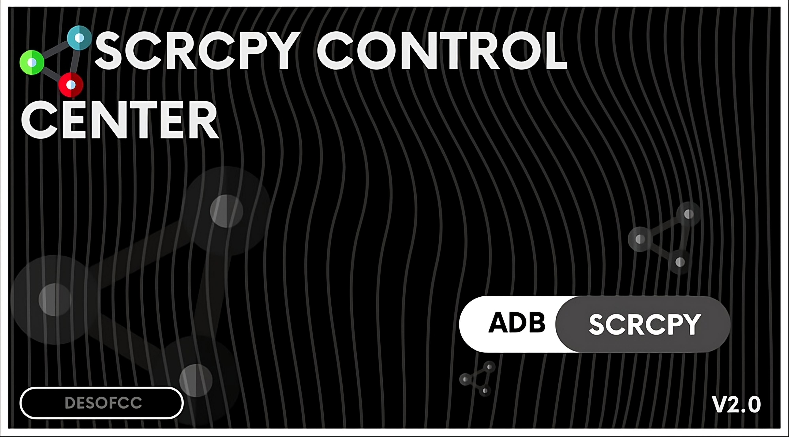
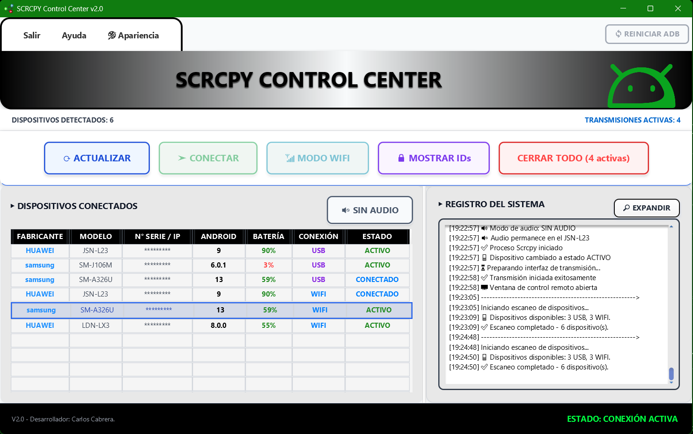
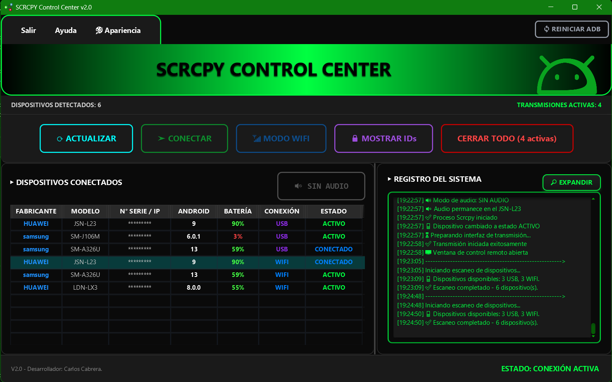
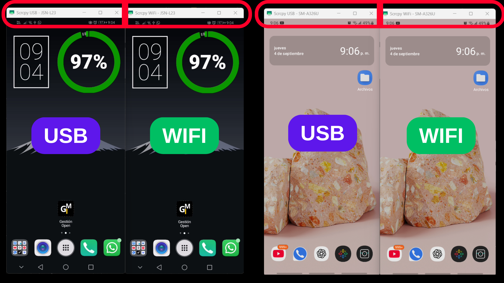

# SCRCPY CONTROL CENTER V2.0

Una interfaz gráfica moderna que integra funciones automatizadas para controlar dispositivos Android desde tu PC sin necesidad de usar la línea de comandos. Soporta conexiones mediante USB y Wi-Fi con detección automática de dispositivos.

### Seguridad y Confianza

Este proyecto ha sido desarrollado bajo principios de ética profesional y seguridad. **Microsoft Security Intelligence confirmó oficialmente que las detecciones previas eran falsos positivos** (Caso resuelto: 21361229-51d6-461a-98c6-b88b67c474a3).

** Estado actual:** Software oficialmente validado como seguro por Microsoft  
** Recomendación:** Uso sin restricciones para ambas versiones

Para evidencias completas y detalles técnicos, revisa [**SEGURIDAD**](https://github.com/EMILIO25CC/SCRCPY-CONTROL-CENTER/blob/main/SECURITY.md).

---
## Características Principales

- **Control remoto completo** de dispositivos Android desde PC
- **Conexión USB y WiFi** con configuración automática
- **Detección automática** de dispositivos conectados
- **Interfaz intuitiva** sin necesidad de conocimientos técnicos
- **Temas personalizables** (claro y oscuro)
- **Transmisión de audio** (Android 10+)
- **Gestión múltiple** de dispositivos simultáneos

## Temas Visuales

- **Tema Claro:** 
- **Tema Oscuro:** 

## Funcionamiento en Acción

*Control simultáneo de múltiples dispositivos Android via USB y WiFi*

## Descargas

### Versión Instalador
Se integra al sistema operativo.  
Crea accesos directos en el menú inicio y/o escritorio.  
Se puede desinstalar fácilmente desde *Agregar o quitar programas*.  
Recomendado si planeas usarlo frecuentemente en la misma PC.  

[**Descargar Instalador**](https://github.com/EMILIO25CC/SCRCPY-CONTROL-CENTER/releases/download/v2.0/Instalador_SCRCPY_Control_Center_v2.0.zip)

### Versión Portable
No requiere instalación.  
Se puede ejecutar directamente desde cualquier carpeta o incluso un USB.  
Ideal si no quieres modificar tu sistema o planeas usarlo en varias computadoras.  

[**Descargar Portable**](https://github.com/EMILIO25CC/SCRCPY-CONTROL-CENTER/releases/download/v2.0/Portable_SCRCPY_Control_Center_v2.0.zip)

---

## Configuración Rápida

### 1. Preparar tu Android

**Activar Modo Desarrollador:**
1. Ajustes → Acerca del teléfono
2. Toca 7 veces en "Número de compilación"
3. Aparecerá "Opciones de desarrollador" en Ajustes

**Habilitar Depuración USB:**
1. Opciones de desarrollador → Depuración USB
2. Activar el interruptor
3. Confirma en la ventana emergente que aparece
4. Al conectar por primera vez, acepta la autorización de la PC

**Habilitar Depuración Inalámbrica:**
1. En Opciones de desarrollador, busca "Depuración inalámbrica" o "Wireless debugging"
2. Activa el interruptor
3. Asegúrate de que el dispositivo y la PC estén en la misma red WiFi

**Opciones adicionales según el dispositivo:**
- **"Permitir depuración ADB en modo solo carga"** - Actívala si aparece en tu dispositivo - (Huawei/Honor)
- **"Depuración USB (Configuración de seguridad)"** - Algunos Samsung y Xiaomi requieren esto
- **"Instalar vía USB"** - Puede ser necesaria en algunos modelos
- **"Verificación de aplicaciones por USB"** - Se recomienda desactivarla para mejor compatibilidad

**Ubicaciones alternativas:**
- En algunos dispositivos puede aparecer como "Opciones para desarrolladores"
- En dispositivos Huawei/Honor: Configuración → Sistema y actualizaciones → Opciones de desarrollador
- En dispositivos Samsung: puede estar dentro de "Configuración avanzada"
### 2. Usar la Aplicación

1. **Conecta tu Android** por cable USB
2. **Abre SCRCPY Control Center** 
3. Tu dispositivo aparecerá automáticamente en la tabla
4. **Haz clic en "CONECTAR"** para iniciar el control remoto

### Para Conexión WiFi (Opcional)
1. Con el dispositivo conectado por USB, haz clic en **"MODO WIFI"**
2. Una vez configurado, puedes desconectar el cable USB
3. El dispositivo seguirá disponible por WiFi

## Componentes de la Interfaz

- **Tabla de dispositivos:** Muestra todos los dispositivos conectados con su información
- **Controles principales:** Actualizar, Conectar, Modo WiFi, Mostrar IDs, Cerrar Todo
- **Barra de estado:** Contador de dispositivos detectados y transmisiones activas
- **Registro del sistema:** Log en tiempo real de todas las operaciones
- **Configuración de audio:** Opción para transmitir audio del dispositivo a la PC

## Solución de Problemas

### Mi dispositivo no aparece
- Verifica que la depuración USB esté habilitada
- Asegúrate de haber aceptado la autorización en el dispositivo
- Usa un cable USB de datos (no solo carga)
- Haz clic en "Actualizar" para reescanear

### Problemas de WiFi
- Dispositivo y PC deben estar en la misma red
- Si se desconecta, reconecta por USB y usa "MODO WIFI" nuevamente
- Para Android 11+: también activa "Depuración inalámbrica"

### Windows SmartScreen
Al ejecutar por primera vez, Windows puede mostrar una advertencia de seguridad:

Esto es completamente normal. La advertencia aparece porque el software es nuevo, no está firmado digitalmente y todavía no cuenta con reputación en Microsoft.
Esto no significa que el archivo sea peligroso.

La notificación de Windows se debe únicamente a que es la primera vez que este archivo se distribuye en internet.
El programa ha sido probado durante su desarrollo y no presentó inconvenientes en los diferentes entornos en los que fue evaluado.

**Para continuar:**
1. Clic en "Más información"
2. Selecciona "Ejecutar de todas formas"

## Información Técnica

- **Desarrollado en:** JavaFX 21+
- **Incluye:** SCRCPY 3.3.1 y ADB 36.0.0
- **Plataforma:** Windows (32/64 bits)
- **Idioma:** Español
- **Licencia:** Apache 2.0

## Documentación Completa

Para información detallada sobre todas las funcionalidades, configuraciones avanzadas y solución de problemas específicos, consulta la **ayuda integrada** en el programa (botón "Ayuda" en la barra superior).

## Desarrollador

**Carlos Cabrera** - Estudiante de Informática

- **GitHub:** [github.com/EMILIO25CC](https://github.com/EMILIO25CC)
- **LinkedIn:** [Carlos Cabrera](https://www.linkedin.com/in/carlos-emilio-cabrera-castañeda-1b8abb34a/)
- **YouTube:** [DeSofCC](https://www.youtube.com/@DeSofCC)

## Licencia
Copyright © 2025 Carlos Cabrera.

Este proyecto se distribuye bajo Licencia Apache 2.0 e integra los binarios de SCRCPY y ADB, también bajo Apache 2.0.
[Licencia Apache 2.0](https://www.apache.org/licenses/LICENSE-2.0)

**Repositorio oficial de SCRCPY:** [github.com/Genymobile/scrcpy](https://github.com/Genymobile/scrcpy)

## Soporte

Para reportar errores o sugerir mejoras, abre un **issue** en este repositorio.

---

**Nota:** Este es un programa nuevo que puede presentar fallos ocasionales. Recomendado para uso en redes locales.
