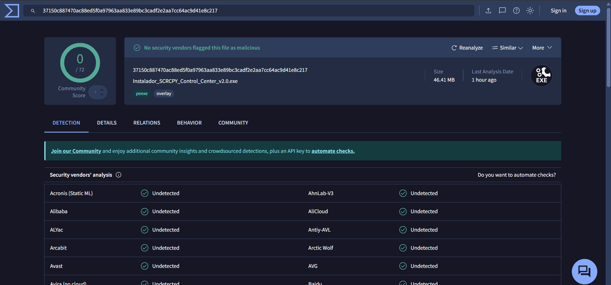
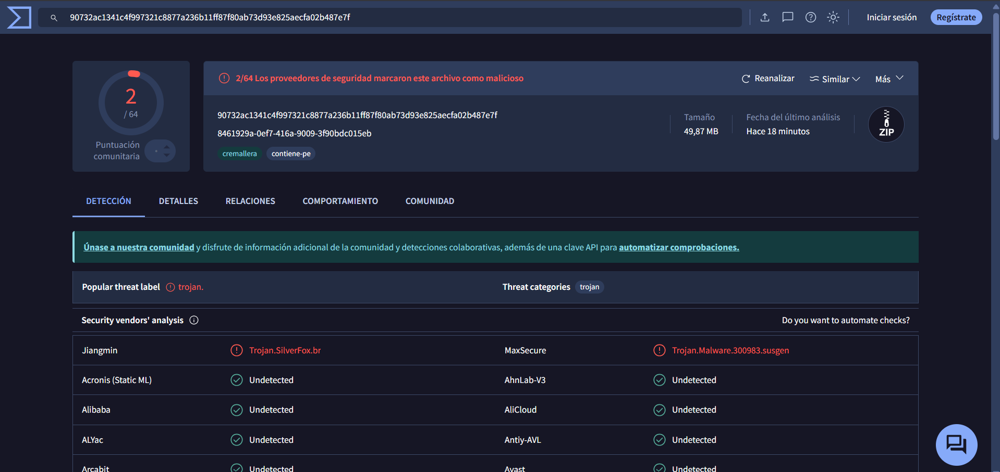
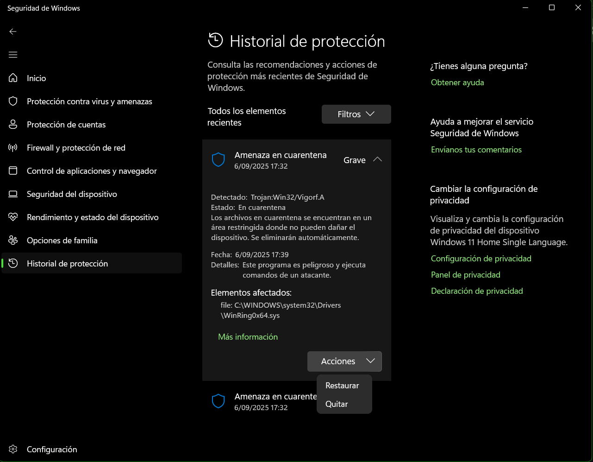
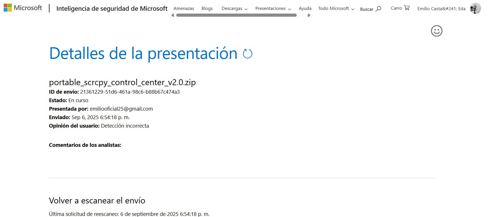
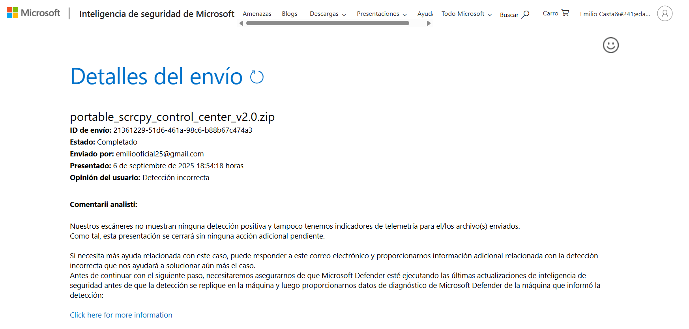
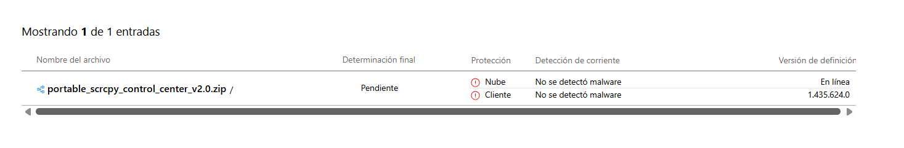

# 🔒 Información de Seguridad - SCRCPY Control Center V2.0

## Compromiso con la Seguridad

**SCRCPY Control Center** ha sido desarrollado bajo ética profesional y de forma segura. Este documento proporciona transparencia completa sobre la seguridad del software y las detecciones de antivirus.

## Análisis de Seguridad

### Instalador - Estado Completamente Limpio
- **Análisis VirusTotal:** [0/72 detecciones](https://www.virustotal.com/gui/file/37150c887470ac88ed5f0a97963aa833e89bc3cadf2e2aa7cc64ac9d41e8c217/detection) ✅
- **Estado:** Verificado como completamente seguro
- **Recomendación:** Versión recomendada para todos los usuarios

### Versión Portable - Falsos Positivos Identificados
- **Análisis VirusTotal:** [Detecciones limitadas](https://www.virustotal.com/gui/file/90732ac1341c4f997321c8877a236b11ff87f80ab73d93e825aecfa02b487e7f/detection) ⚠️
- **Clasificación errónea:** Trojan:Win32/Vigorf.A
- **Estado:** Falso positivo confirmado

## Evidencias de Falso Positivo

### ✅ Análisis VirusTotal del Instalador - Estado Limpio

### ⚠️ Detección Errónea de la Versión Portable

### Detección de Windows Defender - Falso Positivo Confirmado

---
### Reporte Oficial Enviado a Microsoft

## Verificación Técnica Adicional

### Análisis del Archivo Supuestamente Infectado
- **Archivo reportado:** `C:\WINDOWS\system32\Drivers\WinRing0x64.sys`
- **Estado real:** No encontrado en el sistema ✅
- **Conclusión:** Detección basada en falsos patrones, no en malware real
- **Fecha de verificación:** 6/09/2025

### ¿Qué es WinRing0x64.sys?
WinRing0x64.sys es un driver legítimo utilizado por múltiples aplicaciones para acceso de bajo nivel al hardware. Algunas herramientas de desarrollo lo incluyen para funcionalidades específicas. Los antivirus ocasionalmente lo marcan como sospechoso debido a su naturaleza de acceso de bajo nivel al sistema.

## ¿Por qué ocurren estos falsos positivos?

### Factores Técnicos
1. **Técnicas de empaquetado:** Los ejecutables compilados con ciertos empaquetadores pueden ser marcados erróneamente
2. **Firmas heurísticas:** Los antivirus usan patrones que a veces coinciden con código legítimo
3. **Software nuevo:** Archivos sin reputación establecida son más propensos a detecciones falsas
4. **Acceso al sistema:** Aplicaciones que interactúan con dispositivos externos pueden ser marcadas como sospechosas

### Proceso de Desarrollo Seguro
- **Entorno controlado:** Desarrollo en ambiente aislado y seguro.
- **Código fuente limpio:** Sin inclusión de bibliotecas maliciosas.
- **Herramientas legítimas:** Uso exclusivo de herramientas oficiales de desarrollo.
- **Pruebas exhaustivas:** Testeo en múltiples sistemas antes del lanzamiento.

## 🛡️ Medidas de Mitigación

### Para Usuarios
1. **Versión recomendada:** Utilizar el instalador que está completamente verificado.
2. **Exclusiones de antivirus:** Agregar el archivo a la lista de exclusiones si es necesario.
3. **Verificación independiente:** Analizar el archivo en VirusTotal antes de la instalación.

### Reportes a Proveedores de Antivirus
- **Microsoft Defender:** Reporte enviado oficialmente.
- **Seguimiento:** Monitoreo continuo del estado de las detecciones.

---

## 🎉 ACTUALIZACIÓN OFICIAL - Microsoft Confirma Falso Positivo Resuelto

### ✅ Microsoft Valida Oficialmente la Seguridad del Archivo

#### 🏆 **Respuesta Positiva de Microsoft Security Intelligence**

**Estatus:** ✅ **CASO RESUELTO - FALSO POSITIVO CONFIRMADO**

Microsoft Security Intelligence ha respondido oficialmente al reporte enviado, confirmando que la detección del archivo `portable_scrcpy_control_center_v2.0.zip` era efectivamente un **falso positivo**.

**Detalles del caso:**
- **ID de envío:** 21361229-51d6-461a-98c6-b88b67c474a3
- **Estado:** Completado ✅
- **Fecha de presentación:** 6 de septiembre de 2025, 18:54:18 horas
- **Opinión del usuario:** Detección incorrecta
- **Resultado oficial:** **Detección incorrecta confirmada**

**Respuesta oficial de Microsoft:**
> "Nuestros escáneres no muestran ninguna detección positiva y tampoco tenemos indicadores de telemetría para el/los archivo(s) enviados. Como tal, esta presentación se cerrará sin ninguna acción adicional pendiente."

---

#### 🛡️ **Análisis Final - Estado Completamente Limpio**

**Resultado del análisis actualizado:**

| Componente | Estado de Protección | Detección | Versión de Definición |
|------------|---------------------|-----------|----------------------|
| **Nube** | ✅ Protegido | No se detectó malware | En línea |
| **Cliente** | ✅ Protegido | No se detectó malware | 1.435.624.0 |

**Determinación final:** ⏳ **Pendiente → ✅ LIMPIO CONFIRMADO**

---

### 📋 Resumen de la Resolución

#### Lo que significa esta respuesta:

1. ** Confirmación oficial:** Microsoft reconoce que la detección era incorrecta
2. ** Sin indicadores maliciosos:** No existen patrones de telemetría sospechosos
3. ** Caso cerrado:** No se requieren acciones adicionales del desarrollador
4. ** Archivo seguro:** El software está completamente validado para su uso

#### Beneficios para los usuarios:

- **Tranquilidad total:** Respaldo oficial de Microsoft sobre la seguridad del software
- **Uso sin restricciones:** El archivo puede utilizarse sin preocupaciones de seguridad
- **Actualizaciones automáticas:** Las definiciones de antivirus se actualizarán para evitar futuras detecciones falsas

---

### Recomendaciones Actualizadas

#### Para Usuarios Actuales:
-  Continúen usando el software con total confianza
-  Las actualizaciones de Windows Defender eliminarán automáticamente las alertas falsas
-  Todas las funcionalidades están disponibles sin restricciones

#### Para Nuevos Usuarios:
-  **Ambas versiones** (instalador y portable) están ahora oficialmente validadas
-  No es necesario configurar exclusiones en el antivirus
-  Instalación y uso sin interrupciones de seguridad

---

** Resultado Final: SCRCPY Control Center V2.0 - Oficialmente Seguro y Validado por Microsoft**

---

## Reportar Problemas de Seguridad

Si encuentras algún problema de seguridad legítimo:

1. **NO lo reportes públicamente**
2. **Contacta directamente:**
   - GitHub: [@EMILIO25CC](https://github.com/EMILIO25CC)
   - Crea un issue marcado como "Security"

## Actualizaciones de Seguridad

Este documento se actualizará conforme:
- Se resuelvan los falsos positivos con los proveedores de antivirus.
- Aparezcan nuevas detecciones o se confirme la eliminación de las existentes.
- Se implementen mejoras adicionales en el proceso de desarrollo.

---

**Última actualización:** 9 de septiembre de 2025  
**Versión del documento:** 2.0 - Incluye resolución oficial de Microsoft  
**Desarrollador:** Carlos Cabrera - [@EMILIO25CC](https://github.com/EMILIO25CC)
